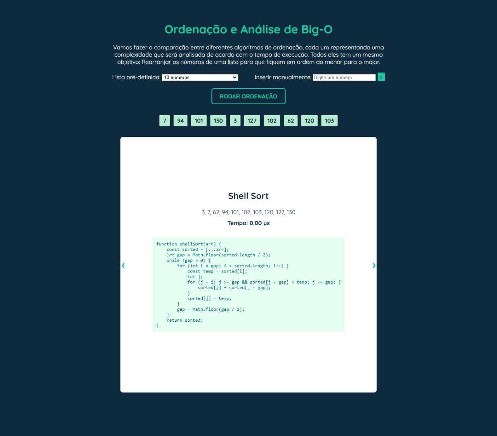

**SOBRE**

  O projeto busca analisar a complexidade temporal de 6 tipos de algoritmos de ordenação: _Bubble Sort, Shell Sort, Quick Sort, Selection Sort, Insertion Sort e Merge Sort_.
  O objetivo é permitir ao usuário entender qual o melhor uso desses diferentes algoritmos por meio de uma interação com simulação front-end.

  
**INSTRUÇÕES DE USO**

1. Clone o projeto em sua pasta de projetos

        git@github.com:seu_usuario/data_structure.git

2. Abra a pasta clonada com o **VS Code** ou IDE de preferência
3. Rode o código em servidor local e interaja livremente

   
